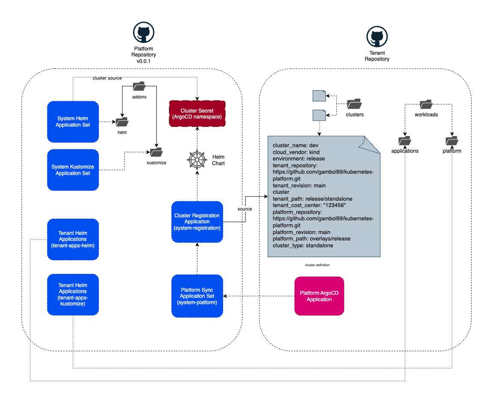

# :material-tools: Architecture

The platform currently support both a standalone and hub and spoke architecture.

<figure markdown="span">
  { align=center }
</figure>

## :material-git: Repository Structure

The platform is composed of two main repositories that work together, This two-repository approach enables:

- Clear separation of platform and environment-specific concerns
- Reuse of core platform components across different deployments
- Independent versioning of platform and tenant configurations
- Simplified environment management and promotion
- Standardized yet flexible application deployment patterns

The tenancy repository imports the platform repository as a dependency, allowing it to leverage the core capabilities while adding environment-specific customizations and applications.

## Deployment Options

Currently we support two deployment options, standalone or hub and spoke.

### Standalone Installation

In a standalone installation, the platform is deployed to a single EKS cluster and manages itself. This self-hosted approach means the platform components (ArgoCD, controllers, etc.) run within the same cluster they are managing.

Key characteristics of standalone mode:

- Single cluster deployment - Platform runs in the same cluster it manages
- Self-hosted GitOps - ArgoCD manages its own configuration and other platform components
- Simplified architecture - No external dependencies or control plane
- Suitable for:
  - Development/testing environments
  - Small-scale production deployments
  - Single-cluster use cases

The standalone mode provides a simpler starting point while still delivering the core platform capabilities. It can later be expanded into a hub-spoke model as needs grow.

### Hub & Spoke

The hub and spoke architecture provides a centralized control plane for managing multiple Kubernetes clusters. In this model, a dedicated management cluster (the "hub") hosts the platform components and orchestrates deployments across multiple workload clusters (the "spokes").

Key characteristics of hub-spoke mode:

- Centralized management - Platform components run in a dedicated control plane cluster
- Multi-cluster orchestration - Single hub can manage many spoke clusters
- Separation of concerns - Clear distinction between management and workload clusters
- Enhanced scalability - Easier to add/remove clusters without affecting platform
- Suitable for:
  - Enterprise environments
  - Multi-cluster/multi-region deployments
  - Production workloads requiring strict separation

The hub cluster runs ArgoCD and other platform components, which then manage the configuration and deployments across all registered spoke clusters. This provides a single point of control while maintaining isolation between the management plane and workload environments.
