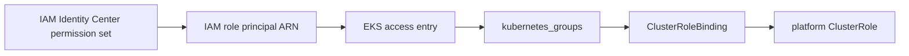

# Cluster roles for SSO access

The platform ships default Kubernetes `ClusterRole` objects for mapping **IAM Identity Center (SSO) permission sets** to predictable, least-privilege cluster access on EKS. The roles are installed by the `cluster-roles` Kustomize addon (`addons/kustomize/oss/cluster-roles/`) and are enabled automatically on every cluster via `enable_core: "true"`.

Use them together with [EKS access entries](https://docs.aws.amazon.com/eks/latest/userguide/access-entries.html): IAM principals authenticate to the cluster, `kubernetes_groups` on the access entry map those principals to Kubernetes groups, and `ClusterRoleBinding` objects grant those groups the platform role permissions.

---

## Available roles

| ClusterRole       | Kubernetes group (recommended) | Purpose                                                                                                                                                                                     |
| ----------------- | ------------------------------ | ------------------------------------------------------------------------------------------------------------------------------------------------------------------------------------------- |
| `platform-viewer` | `platform-viewer`              | Read-only access to cluster resources **except** `Secret` objects. Includes core workloads, RBAC, CRDs, and common platform API groups (cert-manager, Karpenter, Kyverno, VPA, and others). |

Source: `addons/kustomize/oss/cluster-roles/base/cluster-roles.yaml`.

:::tip[Group names]


:::
The Kubernetes group on the EKS access entry **must match** the `subjects[].name` on the `ClusterRoleBinding`. Using the same name as the `ClusterRole` (for example `platform-viewer`) is the simplest convention, but you can use a custom group name as long as the binding references it.

---

## How access flows



1. **Platform** deploys `ClusterRole` resources (`platform-viewer`, `platform-add-nodes`).
2. **Tenant** deploys `ClusterRoleBinding` objects that map a group to each role.
3. **Infrastructure (Terraform or CLI)** creates EKS access entries that associate SSO IAM role ARNs with `kubernetes_groups`.
4. **Optional:** attach AWS-managed [EKS cluster access policies](https://docs.aws.amazon.com/eks/latest/userguide/access-policies.html) via `policy_associations` when you want AWS-native scopes in addition to Kubernetes RBAC.

---

## Bind platform roles in the tenant repository

Deploy a `ClusterRoleBinding` per SSO group. Example for read-only viewers:

```yaml
apiVersion: rbac.authorization.k8s.io/v1
kind: ClusterRoleBinding
metadata:
  name: platform-viewer-binding
  labels:
    app.kubernetes.io/managed-by: argocd
    platform.local/type: tenant
subjects:
  - kind: Group
    name: platform-viewer
    apiGroup: rbac.authorization.k8s.io
roleRef:
  kind: ClusterRole
  name: platform-viewer
  apiGroup: rbac.authorization.k8s.io
```

Example using a **custom** group name (matches the Terraform / CLI examples below):

```yaml
apiVersion: rbac.authorization.k8s.io/v1
kind: ClusterRoleBinding
metadata:
  name: custom-dev-lead-viewer
subjects:
  - kind: Group
    name: custom-dev-lead-group
    apiGroup: rbac.authorization.k8s.io
roleRef:
  kind: ClusterRole
  name: platform-viewer
  apiGroup: rbac.authorization.k8s.io
```

Place bindings under `workloads/system/` in the tenant repository (see [Tenant system workloads](../tenant/system.md)).

---

## Terraform — `access_entries` on EKS

The platform Terraform wrapper passes `access_entries` to the [`appvia/eks/aws`](https://github.com/appvia/terraform-aws-eks) module (see `terraform/main.tf`). Use the module `access_entries` variable to register SSO principals and map them to Kubernetes groups.

### RBAC-only (platform `platform-viewer`)

No AWS access policy is required when Kubernetes RBAC alone defines permissions:

```hcl
access_entries = {
  developer_viewer = {
    principal_arn = "arn:aws:iam::123456789012:role/aws-reserved/sso.amazonaws.com/eu-west-2/AWSReservedSSO_DeveloperAccess_abcdef1234567890"
    kubernetes_groups = ["platform-viewer"]
  }
}
```

### Custom group name → `platform-viewer` role

```hcl
access_entries = {
  dev_lead = {
    principal_arn = "arn:aws:iam::123456789012:role/aws-reserved/sso.amazonaws.com/eu-west-2/AWSReservedSSO_DevLead_abcdef1234567890"
    kubernetes_groups = ["custom-dev-lead-group"]
  }
}
```

Pair with the `ClusterRoleBinding` example above that binds `custom-dev-lead-group` to `platform-viewer`.

### Node operators (`platform-add-nodes`)

```hcl
access_entries = {
  platform_ops = {
    principal_arn = "arn:aws:iam::123456789012:role/aws-reserved/sso.amazonaws.com/eu-west-2/AWSReservedSSO_PlatformOps_abcdef1234567890"
    kubernetes_groups = ["platform-add-nodes"]
  }
}
```

### AWS-managed policy + Kubernetes groups

Combine an [EKS access policy](https://docs.aws.amazon.com/eks/latest/userguide/access-policies.html) with `kubernetes_groups` when you want AWS-scoped permissions **and** platform RBAC (for example extra CRD visibility from `platform-viewer`):

```hcl
access_entries = {
  developer_hybrid = {
    principal_arn = "arn:aws:iam::123456789012:role/aws-reserved/sso.amazonaws.com/eu-west-2/AWSReservedSSO_DeveloperAccess_abcdef1234567890"
    kubernetes_groups = ["platform-viewer"]
    policy_associations = {
      view = {
        policy_arn = "arn:aws:eks::aws:cluster-access-policy/AmazonEKSViewPolicy"
        access_scope = {
          type = "cluster"
        }
      }
    }
  }

  cluster_admin = {
    principal_arn = "arn:aws:iam::123456789012:role/aws-reserved/sso.amazonaws.com/eu-west-2/AWSReservedSSO_AdministratorAccess_abcdef1234567890"
    policy_associations = {
      cluster_admin = {
        policy_arn = "arn:aws:eks::aws:cluster-access-policy/AmazonEKSClusterAdminPolicy"
        access_scope = {
          type = "cluster"
        }
      }
    }
  }
}
```

This repository also merges an administrator entry when `sso_administrator_role` is set (`terraform/settings.access.tf`).

### Variable shape (`terraform-aws-eks`)

```hcl
variable "access_entries" {
  description = "Map of access entries to add to the cluster."
  type = map(object({
    kubernetes_groups = optional(list(string), [])
    principal_arn     = string
    policy_associations = optional(map(object({
      policy_arn = string
      access_scope = object({
        namespaces = optional(list(string), [])
        type       = optional(string, "cluster")
      })
    })))
  }))
  default = null
}
```

---

## AWS CLI

### Create access entry (RBAC via `kubernetes_groups`)

```bash
aws eks create-access-entry \
  --cluster-name my-cluster \
  --principal-arn arn:aws:iam::123456789012:role/AWSReservedSSO_DeveloperAccess_abcdef1234567890 \
  --kubernetes-groups platform-viewer \
  --type STANDARD
```

Custom group name (must match `ClusterRoleBinding` subject):

```bash
aws eks create-access-entry \
  --cluster-name my-cluster \
  --principal-arn arn:aws:iam::123456789012:role/AWSReservedSSO_DevLead_abcdef1234567890 \
  --kubernetes-groups custom-dev-lead-group \
  --type STANDARD
```

### Associate an AWS-managed access policy (optional)

```bash
aws eks associate-access-policy \
  --cluster-name my-cluster \
  --principal-arn arn:aws:iam::123456789012:role/AWSReservedSSO_DeveloperAccess_abcdef1234567890 \
  --policy-arn arn:aws:eks::aws:cluster-access-policy/AmazonEKSViewPolicy \
  --access-scope type=cluster
```

Common policy ARNs:

| Policy        | ARN suffix                    |
| ------------- | ----------------------------- |
| Cluster admin | `AmazonEKSClusterAdminPolicy` |
| Admin         | `AmazonEKSAdminPolicy`        |
| Edit          | `AmazonEKSEditPolicy`         |
| View          | `AmazonEKSViewPolicy`         |

### Verify

```bash
aws eks list-access-entries --cluster-name my-cluster

aws eks describe-access-entry \
  --cluster-name my-cluster \
  --principal-arn arn:aws:iam::123456789012:role/AWSReservedSSO_DeveloperAccess_abcdef1234567890
```

After binding, confirm Kubernetes RBAC:

```bash
kubectl auth can-i list pods --as-group=platform-viewer
kubectl auth can-i get secrets --as-group=platform-viewer   # expect no
```

---

## Choosing AWS policies vs platform roles

| Approach                                                                        | When to use                                                                                                                                                            |
| ------------------------------------------------------------------------------- | ---------------------------------------------------------------------------------------------------------------------------------------------------------------------- |
| **Platform `ClusterRole` only** (`kubernetes_groups`, no `policy_associations`) | Full control via GitOps RBAC; consistent across clouds; use `platform-viewer` to exclude secrets while still reading RBAC and platform CRDs.                           |
| **AWS access policy only**                                                      | Quick baseline aligned with AWS documentation; no tenant `ClusterRoleBinding` required.                                                                                |
| **Both**                                                                        | AWS policy for baseline namespace/cluster scope; platform roles for supplemental permissions (for example Karpenter or VPA CRDs not covered by `AmazonEKSViewPolicy`). |

---

## Enabling and extending

| Item         | Detail                                                         |
| ------------ | -------------------------------------------------------------- |
| Feature flag | `enable_core: "true"` (on by default via cluster registration) |
| Addon path   | `addons/kustomize/oss/cluster-roles/`                          |
| Sync phase   | `primary` (deployed early)                                     |

To grant read access to additional CRD API groups, extend the rules in `cluster-roles.yaml` under the platform extension API groups list, or add tenant-specific `ClusterRole` objects that aggregate to your SSO groups.

---

## Related documentation

- [Tenant system workloads](../tenant/system.md) — deploying cluster-scoped tenant resources
- [Kyverno](kyverno.md) — admission policy (complements RBAC)
- [Terraform module README](https://github.com/appvia/terraform-aws-eks) — full `access_entries` reference
